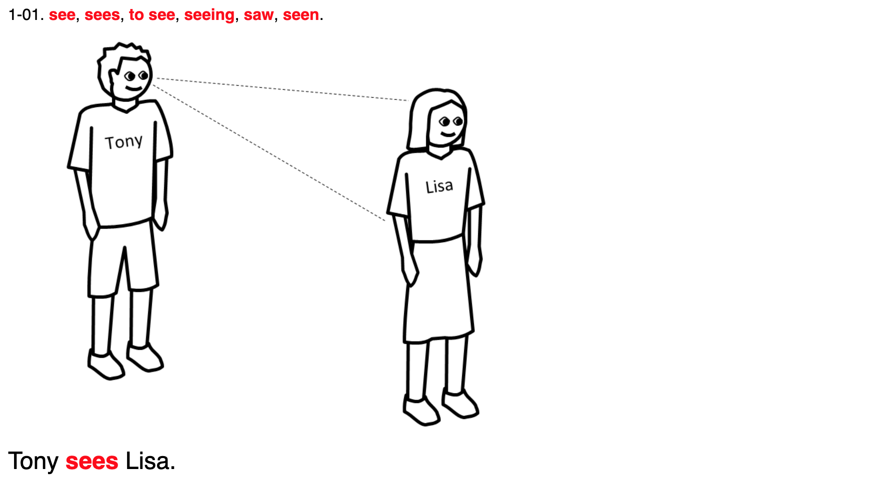

## Formal system

> A formal system is like a game in which **tokens** are manipulated according to **rules** in order to see what configurations can be obtained. Examples: chess, checkers, go, tic-tac-toe. Nonexamples: marbles, billiards, baseball.
>
> -- [What is a Formal System?](https://www.cs.indiana.edu/~port/teach/641/formal.sys.haug.html)

> ---
>
> A formal system consists of a language over some alphabet of **symbols** together with (axioms and) **inference rules** that distinguish some of the strings in the language as theorems.
>
> -- [Formal Systems](https://cs.lmu.edu/~ray/notes/formalsystems/)

> ---
>
> Each formal system has a formal language composed of primitive **symbols** acted on by certain **rules** of formation (statements concerning the symbols, functions, and sentences allowable in the system) and developed by inference from a set of axioms.
>
> In an axiomatic system, the primitive symbols are undefined; and all other symbols are defined in terms of them.
>
> -- [Britanica](https://www.britannica.com/topic/formal-system)

Given some set of [symbols](/posts/symbolic-thinking) (or tokens) and some rules on how we can put those symbols together, we can produce new configurations. This is a very simple idea which lies in the center of logic and math.

### Examples

Construction toys (like Lego), can be thought as formal systems. You have a set of tokens, and rules are based on physical restrictions.

The "MU Puzzle" proposed by Hofstadter in his [GEB book](https://ocw.mit.edu/high-school/humanities-and-social-sciences/godel-escher-bach/video-lectures/lecture-1-video/).

[Peano axioms](https://www.britannica.com/science/Peano-axioms) which describe natural numbers with `0` and `+1` (successor operation).

[Euclidean geometry](https://archive.org/details/firstsixbooksofe00byrn/page/n6) which builds a set of rules based on a small set of axioms.

[John Conway's Game of Life](https://bitstorm.org/gameoflife/) consists of a field of cels and rules which define the state of the board on the next move.

### Metalogic

> Metalogic has led to a great deal of work of a mathematical nature in axiomatic set theory, model theory, and recursion theory (in which functions that are computable in a finite number of steps are studied).
>
> -- [Britanica](https://www.britannica.com/topic/metalogic/Influences-in-other-directions)

## Axiom

> Axiom, in logic, an indemonstrable first principle, rule, or maxim, that has found general acceptance or is thought worthy of common acceptance whether by virtue of a claim to intrinsic merit or on the basis of an appeal to self-evidence. An example would be: “Nothing can both be and not be at the same time and in the same respect.”
>
> -- [Britanica](https://www.britannica.com/topic/axiom)

> ---
>
> 1. a statement accepted as true as the basis for argument or inference
> 2. an established rule or principle or a self-evident truth
> 3. a maxim widely accepted on its intrinsic merit
>
> -- [Merriam-Webster](https://www.merriam-webster.com/dictionary/axiom)

Axiom is some statement which is given without proof. Both symbols and rules from formal systems can be referred to as axioms.

> Cogito, ergo sum. (Latin for "I think, therefore I am")
>
> -- René Descartes

If axioms are unprovable how do we know what we know? Isn't it all just a castle built in the air.

### Dictionary

If we would investigate natural language we would find that we use words to define words. Dictionary is built with words.

There is a different approach to this problem - [A Non-Circular Dictionary of English](http://learnthesewordsfirst.com/about/what-is-a-multi-layer-dictionary.html):

- **Basic vocabulary**: The most basic words are explained for beginning-level learners, using illustrations, translations, etc. These words are presented in a series of short lessons.
- **Defining vocabulary**: These intermediate-level words are explained using only the words from the basic vocabulary lessons.
- **Full dictionary**: This includes advanced-level words, all explained using only the defining vocabulary.

## Model

> To model a phenomenon is to construct a formal theory that describes and explains it. (In a closely related sense, you model a system or structure that you plan to build, by writing a description of it.)
>
> -- [SEP](https://plato.stanford.edu/entries/model-theory/)

> ---
>
> A map is not the territory it represents, but, if correct, it has a similar structure to the territory, which accounts for its usefulness.
>
> -- Science and Sanity, Alfred Korzybski

Model is not the same as reality. It is just a useful representation. The usefulness of the model comes from it impreciseness - some details removed, which allows us to focus on what matters (see [abstraction](/posts/abstraction)).

Because the model is just some symbolic representation of reality, it can "fit" for more than one reality. When we find similarities between different models we call it correspondence, for example, see [Physics, Topology, Logic, and Computation: A Rosetta Stone](https://arxiv.org/pdf/0903.0340.pdf).

| Category Theory | Physics | Topology  | Logic       | Computation |
| --------------- | ------- | --------- | ----------- | ----------- |
| object          | system  | manifold  | proposition | data type   |
| morphism        | process | cobordism | proof       | program     |

As well we can define more than one model to represent the same reality.
