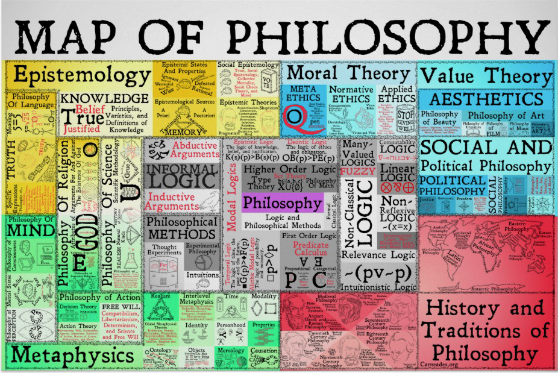
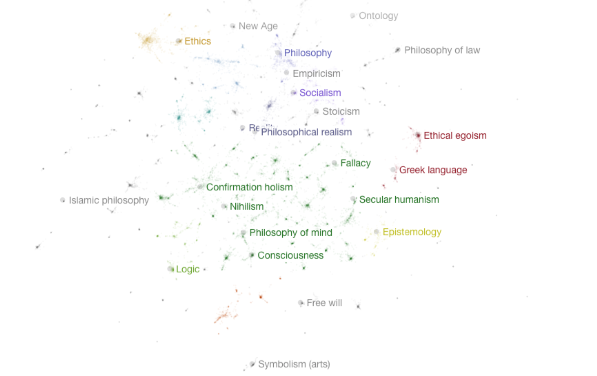
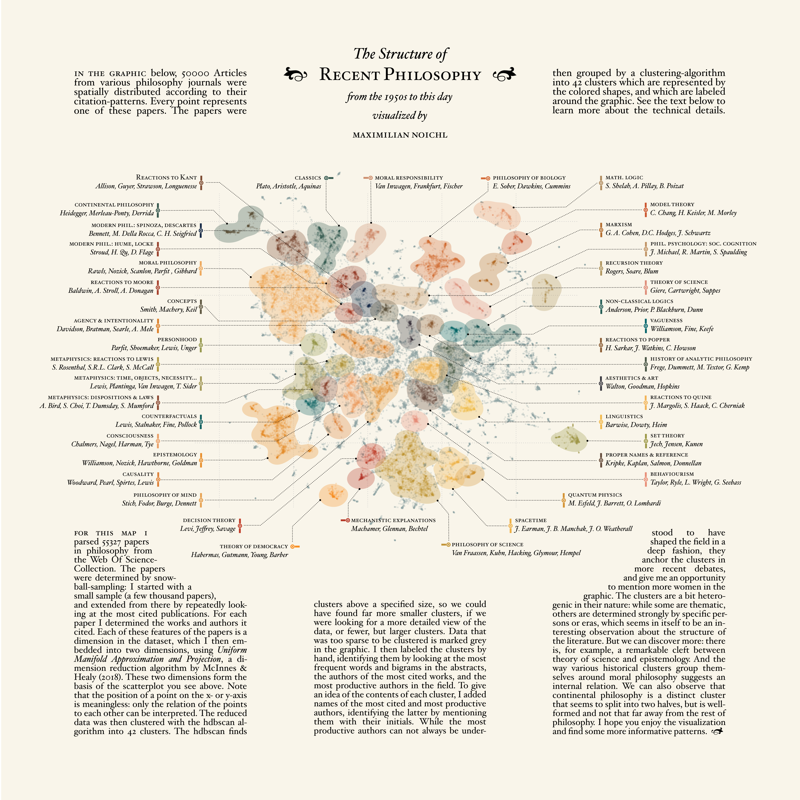

## Definition of philosophy

> (1) all learning exclusive of technical precepts and practical arts
> ...
>
> -- [Merriam-Webster](https://www.merriam-webster.com/dictionary/philosophy)

Philosophy is a very wide branch of human knowledge. There were times when philosophy was the only thing you can study. Later other studies start to split out of philosophy and become "independent" studies (sciences, other disciplines).

<!--more-->

[This video](https://www.youtube.com/watch?v=YxBShJU_CKs) by carneades.org talks about the history of philosophy and the map of philosophy:



### Philosophy and science

The fact that some disciplines split out from philosophy doesn't mean they split out completely - all-natural sciences rely on math as a modeling tool, (math is a study about the formal system) formal systems rely on axioms which goes without proof e.g. the science itself is not able to investigate premises of the science.

Another question is "how to interpret results of science": some results have practical implications and maybe doesn't need interpretation beyond that, but some may have "deeper" meaning, for example, observer effect in quantum physics.

> **The philosophy of science is concerned with all the assumptions, foundations, methods, implications of science, and with the use and merit of science.** This discipline sometimes overlaps metaphysics, ontology and epistemology, viz., when it explores whether scientific results comprise a study of truth. In addition to these central problems of science as a whole, many philosophers of science consider problems that apply to particular sciences (e.g. philosophy of biology or philosophy of physics). Some philosophers of science also use contemporary results in science to reach conclusions about philosophy.
>
> Philosophy of science has historically been met with mixed response from the scientific community. Though scientists often contribute to the field, many prominent scientists have felt that the practical effect on their work is limited; a popular quote attributed to physicist Richard Feynman goes, "Philosophy of science is about as useful to scientists as ornithology is to birds." In response, some philosophers (e.g. Craig Callender[1]) have suggested that ornithological knowledge would be of great benefit to birds, were it possible for them to possess it.
>
> **Scientific realism and instrumentalism**
>
> Two central questions about science are (1) what are the aims of science and (2) how should one interpret the results of science? Scientific realists claim that science aims at truth and that one ought to regard scientific theories as true, approximately true, or likely true. Conversely, a scientific antirealist or instrumentalist argues that science does not aim (or at least does not succeed) at truth, and that it is a mistake to regard scientific theories as even potentially true. Some antirealists claim that scientific theories aim at being instrumentally useful and should only be regarded as useful, but not true, descriptions of the world.
>
> -- [Philosophy of science (Stanford)](https://web.stanford.edu/class/symsys130/Philosophy%20of%20science.pdf)

Image source: [Philosophy in figures](https://philosophy-in-figures.tumblr.com/).

See also:

- [Opinion: Why science needs philosophy](https://www.pnas.org/content/116/10/3948)
- [The philosophy of science (Berkeley)](https://undsci.berkeley.edu/article/philosophy)

On the other side, philosophers don't like when science steps into their territory either. When biologists explained morality as an [evolution thing](https://www.youtube.com/watch?v=b_Lm49XVkGQ) (see also [Prisoner’s Dilemma](https://plato.stanford.edu/entries/prisoner-dilemma/)) they got mad letters from philosophers that morality is the result of ethics studies or that morality comes from religion.

## Map of philosophy

Philosophy is a very broad field of studies. It would be nice to have a "map" to be able to navigate. There were several attempts to map philosphy:

Map by [carneades.org](https://carneades.org/lp-courses/):

[A Taxonomic Map of Philosophy](http://dailynous.com/2016/06/28/a-taxonomic-map-of-philosophy/), which is based on [taxonomy from PhilPapers](https://philpapers.org/browse/all):

[Map from philosophies.space](http://map.philosophies.space/):

[The structure of recent philosophy](https://homepage.univie.ac.at/noichlm94/posts/structure-of-recent-philosophy-iii/)

[Map of philosophical positions & their correlations among philosophers, based on Bourget & Chalmers' famous 2011 survey of philosophers (alternative title, maybe: "An empirical look at contemporary philosophy 'schools'")](https://twitter.com/ATFyfe/status/1105173286609190912):

[A co-citation network for philosophy](https://kieranhealy.org/blog/archives/2013/06/18/a-co-citation-network-for-philosophy/):

[Graphing the history of philosophy](./http://www.coppelia.io/2012/06/graphing-the-history-of-philosophy/):

